

  <picture>
    <source media="(max-width: 600px)" srcset="./assets/readme/header-mobile.svg" />
    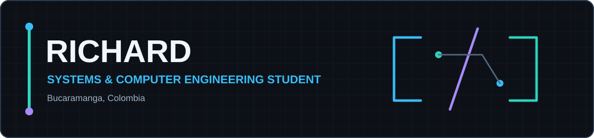
  </picture>

<h1 align="center"><b>Hi, I'm Richard</b> </h1>

  <strong>David Ricardo Carvajal Barragán</strong> 
  Systems and Computer Engineering Student from Bucaramanga, Colombia 🇨🇴

  

  
  
  

---

<h2 align="center"> About me</h2>

  

<!--
About content rendered inside the local SVG panel:
I am a Systems and Computer Engineering student who enjoys building solutions that combine clean design, solid logic, and real functionality. I am especially interested in web development, desktop applications, UI-focused design, and technical problem-solving.
I like working on projects where I can contribute both visually and technically, from interface structure and user experience to code organization and system behavior. I value teamwork, collaboration, and helping others achieve shared goals through commitment, adaptability, and continuous improvement.
I also adapt well to AI-assisted workflows as a professional support tool for development, analysis, and productivity, while keeping critical thinking and technical judgment at the center of the process.
Outside technology, I enjoy football, creative challenges, and learning experiences that push me to grow both personally and professionally.
The original animated GIF is preserved locally from https://media.giphy.com/media/ZVik7pBtu9dNS/giphy.gif.
-->

  <picture>
    <source media="(max-width: 800px)" srcset="./assets/readme/about-panel-mobile.svg" />
    
  </picture>

<h2 align="center"> Current Focus</h2>

  

<!--
Current Focus content rendered inside the local SVG pipeline:
01 BUILD — Building clean and functional web and desktop applications
02 DESIGN — Improving UI/UX design and front-end structure
03 LOGIC — Strengthening software logic, architecture, and technical problem-solving
04 AI — Applying AI-assisted workflows in a practical and professional way
05 GROW — Growing through collaboration, new challenges, and continuous learning
-->

  <picture>
    <source media="(max-width: 800px)" srcset="./assets/readme/focus-panel-mobile.svg" />
    
  </picture>

---

<h2 align="center"> My Skills Include</h2>

  

<!--
Skills overview content rendered inside the local SVG panel:
01 // LANGUAGES — Java · Python · JavaScript · TypeScript · C#
02 // FRONTEND / UI — HTML · CSS · React · Tailwind CSS · Figma · JavaFX
03 // DATABASES — PostgreSQL · MySQL · MySQL Workbench · SQL Server
04 // TOOLS — Docker · Git · GitHub · GitHub Desktop · StarUML · AI Assisted Workflows
05 // IDEs — Visual Studio Code · Visual Studio · IntelliJ IDEA · Eclipse · WebStorm · Windsurf
06 // OPERATING SYSTEMS — Linux · Windows
-->

  <picture>
    <source media="(max-width: 800px)" srcset="./assets/readme/skills-panel-mobile.svg" />
    
  </picture>

<h3 align="center"><code>01</code>  Programming Languages</h3>

  

<h3 align="center"><code>02</code>  Frontend, UI & Desktop Development</h3>

  

  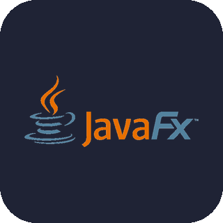

<h3 align="center"><code>03</code>  Databases</h3>

  

  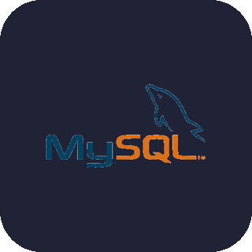
  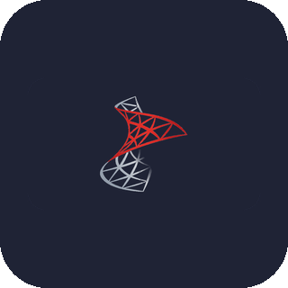

<h3 align="center"><code>04</code>  Tools & Technologies</h3>

  

  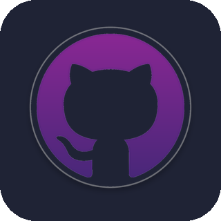
  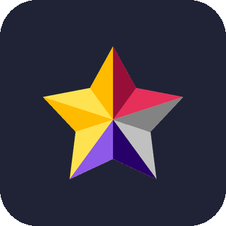
  

<h3 align="center"><code>05</code>  IDEs & Development Environments</h3>

  

  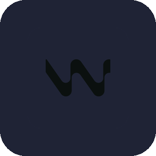

<h3 align="center"><code>06</code>  Operating Systems</h3>

  

---

<h2 align="center"> Featured Projects & Contributions</h2>

  

<!--
Project descriptions rendered inside the local SVG cards:
StaffTrain — I developed StaffTrain as an academic desktop application for passenger train management, focused on combining clean interface design, structured system logic, and functional desktop software development. This project allowed me to strengthen my skills in application architecture, user-oriented design, and the implementation of organized technical solutions.
Hegemony Linear — I contributed as part of the development team for Hegemony Linear, an academic web project for Numerical Analysis inspired by the board game Hegemony: Lead Your Class to Victory. The application combines an interactive economic simulation with applied numerical methods, using a React/Vite frontend, a FastAPI backend, and a Newton-Raphson engine to support game-based learning and professor-oriented analysis.
UPB Educational Credit Simulator — I contributed as part of the development team for an institutional full-stack web application built as an academic project with a real client at Universidad Pontificia Bolivariana, Bucaramanga. The system supports educational financing simulation through structured business rules, role-based user flows, financial summaries, amortization tables, administrative management, formal documentation, testing, and production deployment.
Ruta 7 Ríos Tourism Platform — I contributed as part of the development team for Ruta 7 Ríos, an academic tourism platform for Santiago de Cali developed within Track 2 of the integrator project. My work supported the public and informative web experience, visual identity, and user-oriented presentation of cultural, natural, salsa, and gastronomic tourism content within a broader solution that also involved backend services, infrastructure, connectivity, and deployment evidence.
Veterinary Management System — I contributed to the development of an academic ERP-style management system for veterinary clinics, supporting software implementation, interface design, and desktop application structure for a complete operational solution.
-->

  <picture>
    <source media="(max-width: 800px)" srcset="./assets/readme/projects-panel-mobile.svg" />
    
  </picture>

  <picture>
    <source media="(max-width: 800px)" srcset="./assets/readme/project-stafftrain-mobile.svg" />
    
  </picture>

<strong>Repository:</strong> <a href="https://github.com/Richard117297/StaffTrain">StaffTrain</a>

  <picture>
    <source media="(max-width: 800px)" srcset="./assets/readme/project-hegemony-linear-mobile.svg" />
    
  </picture>

  <strong>Repository:</strong> <a href="https://github.com/Dabji/Hegemony-Linear">Hegemony Linear</a> 
  <strong>Live Demo:</strong> <a href="https://hegemony-linear.vercel.app/">hegemony-linear.vercel.app</a>

  <picture>
    <source media="(max-width: 800px)" srcset="./assets/readme/project-upb-credit-simulator-mobile.svg" />
    
  </picture>

  <strong>Repository:</strong> <a href="https://github.com/Dabji/Simulador-Credito-UPB">Simulador de Crédito Educativo UPB</a> 
  <strong>Production Application:</strong> <a href="https://simuladorfinanciaciondirecta.bucaramanga.upb.edu.co/">simuladorfinanciaciondirecta.&#8203;bucaramanga.&#8203;upb.edu.co</a>

  <picture>
    <source media="(max-width: 800px)" srcset="./assets/readme/project-ruta-7-rios-mobile.svg" />
    
  </picture>

<strong>Repository:</strong> <a href="https://github.com/Dabji/Turismo-Cali-UPB">Turismo Cali - Ruta 7 Ríos</a>

  <picture>
    <source media="(max-width: 800px)" srcset="./assets/readme/project-veterinary-management-mobile.svg" />
    
  </picture>

<strong>Repository:</strong> <a href="https://github.com/Dabji/Veterinaria.git">Veterinaria SOS</a>

---

<h2 align="center"> Connect with me</h2>

  

  <picture>
    <source media="(max-width: 800px)" srcset="./assets/readme/connect-panel-mobile.svg" />
    
  </picture>

  <a href="https://github.com/Richard117297" target="_blank">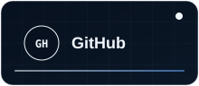</a>
  <a href="https://www.linkedin.com/in/david-ricardo-carvajal-barragan-20a686332/" target="_blank">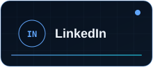</a>
  <a href="mailto:richardcarvajalb@gmail.com">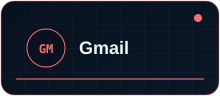</a>
  <a href="https://www.instagram.com/richard__carvajal/" target="_blank">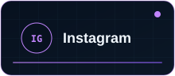</a>
  

  
  
  
  
  

---

<h2 align="center"> GitHub Stats</h2>

  

  <picture>
    <source media="(max-width: 800px)" srcset="./assets/readme/stats-panel-mobile.svg" />
    
  </picture>

  
   
  
  

---

  <picture>
    <source media="(max-width: 800px)" srcset="./assets/readme/terminal-panel-mobile.svg" />
    
  </picture>

  

  <em>Always learning, building, and improving through technology.</em>

